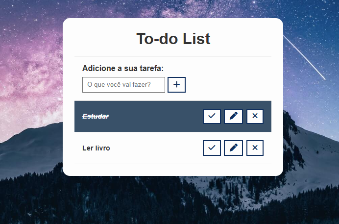

# MeuApp

Uma to-do list (Lista de tarefas) funcional, com criação, edição e exclusão de tarefas. LocalStorage integrado, para salvamento de tarefas antes adicionadas, assim podendo fechar o website, e abrindo posteriormente, que suas tarefas adicionadas estaram salvas, e listadas.

## Funcionalidades
- Criação de tarefas
- Edição e exclusão de tarefas
- Salvamento de tarefas em LocalStorage

## Tecnologias Usadas
- Html
- Css
- JavaScript

## Instalação
Basta abrir o website [To-do List](projeto-to-list.netlify.app), e já começar a usar das funcionalidades
